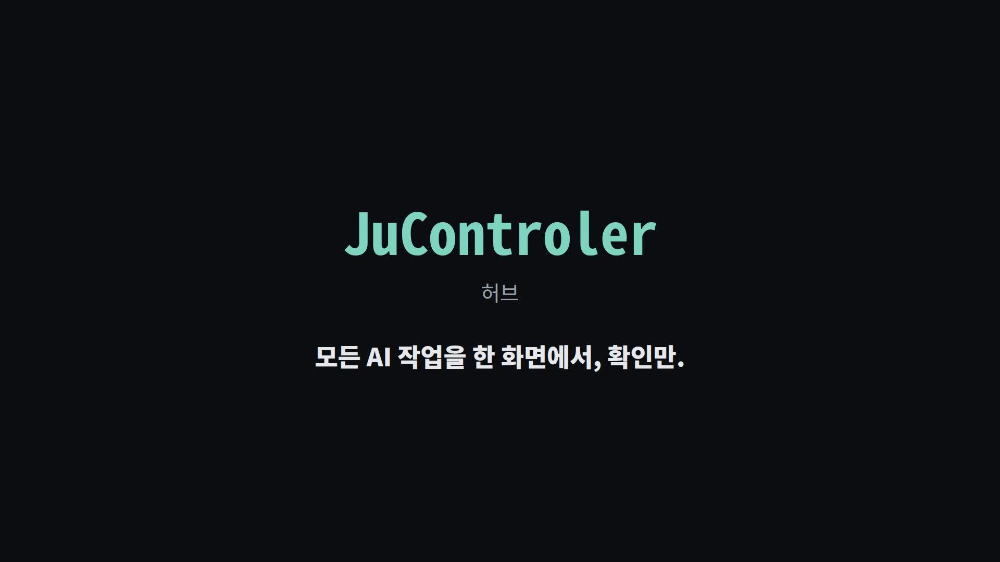

# JuControler

## 1. 한 줄 소개

**여러 AI 비서가 만드는 프로젝트들의 상태를 한 화면(상태판)에 모아 보여 주는 허브입니다.**

## 30초 소개 영상

[](docs/media/jucontroler-30s.mp4)

전체 소개 (60초): https://youtu.be/tB1cCLzTvIs

개발자가 아니어도 Claude Code, Codex 같은 AI 비서 여러 개에게 일을 맡기는 사람을
위해 만들었습니다. "지금 어느 프로젝트가 어디까지 왔지?"를 파일을 하나하나 열지 않고
확인하는 것이 목표입니다.

## 2. 지금 되는 것

- **상태판 한 장** — 내 프로젝트 목록 파일을 주면 모든 프로젝트의 상태를 한 번에
  보여 줍니다. 읽기만 하고, 아무것도 실행하거나 바꾸지 않습니다.
- **네 가지 원본 읽기** — 저장소 상태 파일, JuPlan 상태, JuCeipt 영수증, Agent Relay
  야간 보드 스냅샷을 같은 모양으로 맞춰 보여 줍니다.
- **모르는 건 모른다고 표시** — 파일이 없거나 오래됐으면(기본 5분) 추측하지 않고
  `UNKNOWN`/`stale`과 짧은 한국어 이유를 보여 줍니다.
- **쉬운 한국어 오류 안내** — 목록 파일이 틀리면 몇 번째 항목의 어느 칸인지 알려 주고,
  없는 프로젝트 ID를 물으면 목록에 있는 ID를 보여 줍니다.
- **한 번에 전체 점검** — 명령 하나로 연습용 목록을 만들어 상태판을 돌려 보고
  결과를 JSON 한 줄로 알려 줍니다.
- **AI 운영 규칙 파일** — AI 자동 배정, Skill 장착, 승인한 기억, Tester 권한 같은
  규칙을 파일로 적어 두고 테스트로 모양을 확인합니다. 규칙은 아직 적어만 둔 상태입니다.

## 3. 빠른 시작 (처음 쓰는 법)

준비물은 Node.js 22 이상과 bash뿐입니다. 설치할 것도 없고 인터넷도 쓰지 않습니다.
저장소 맨 위 폴더에서 차례로 입력하세요.

```sh
bash scripts/e2e.sh
node --test tests/*.test.mjs
node scripts/status-board.mjs <registry.json> [--project-id <id>]
```

1. `bash scripts/e2e.sh` — 전체 흐름을 한 번에 점검합니다. 끝에 `"ok":true`와
   `모두 정상이에요`가 나오면 정상입니다.
2. `node --test tests/*.test.mjs` — 자동 테스트를 모두 돌립니다. 마지막에 `fail 0`이면
   정상입니다.
3. `node scripts/status-board.mjs <registry.json>` — 내 프로젝트 목록 파일로 상태판을
   봅니다. `--project-id <id>`를 붙이면 그 프로젝트 하나만 보여 줍니다.

내 `registry.json`은 아래를 복사해서 값만 바꾸면 됩니다. 상태 파일은
`<dataRoot>/current.json`에 둡니다.

```json
{
  "projects": [
    {
      "projectId": "my-project",
      "workspaceRoot": "/work/my-project",
      "dataRoot": "/data/my-project",
      "sourceRef": "my-project/status",
      "sourceKind": "repository-status-file"
    }
  ]
}
```

점검 결과 읽는 법, 목록 파일 규칙, `sourceKind` 네 종류, 규칙 파일 목록은
[docs/getting-started.md](docs/getting-started.md)에 있습니다.

상태판에 `reason`이 보이면 아래 표로 뜻과 다음 할 일을 확인하세요.

| `reason` | 뜻 | 다음 할 일 |
| --- | --- | --- |
| `unavailable` | `current.json`이 없거나 JSON으로 읽을 수 없어요. | `<dataRoot>/current.json`이 있는지, 올바른 JSON인지 확인하세요. |
| `invalid-request` | 요청 값(`projectId`나 `freshnessMs`)이 잘못됐어요. | `registry.json`의 `projectId`와 `freshnessMs`(0 이상 숫자)를 고치세요. |
| `malformed` | 저장된 값이 JSON 객체가 아니에요. | 파일 내용이 `{ ... }` 모양인지 확인하세요. |
| `invalid` | `current.json`이 `project-status.v1` 모양이 아니거나 보드 스냅샷 구조가 깨졌어요. | 빠진 칸, 틀린 `projectId`, 미래 시각이 없는지 확인하고 원본에서 다시 저장하세요. |
| `project-mismatch` | 파일 속 `projectId`가 목록의 `projectId`와 달라요. | 두 값을 같게 맞추세요. |
| `invalid-stale` | 파일 속 `stale`이 `true`/`false`가 아니에요. | `stale`을 `true`나 `false`로 고치거나 지우세요. |
| `missing-status` | 파일에 `status`가 없거나 비어 있어요. | 원본에서 `status`를 채워 다시 저장하세요. |
| `missing-lane` | 보드 스냅샷에 그 id의 레인이 없어요. | `projectId`가 레인 id와 같은지 확인하세요. |
| `missing-state` | 레인의 `state`가 없거나 비어 있어요. | Agent Relay 보드 스냅샷을 새로 저장하세요. |
| `invalid-holds` | 레인의 `holds`가 목록(배열)이 아니에요. | 보드 스냅샷을 새로 저장하세요. |
| `human-gate` | 사람 확인을 기다리는 레인이에요. 상태는 그대로예요. | 해당 레인의 확인 요청을 처리하세요. |
| `hold` | 레인이 보류 중이에요. 상태는 그대로예요. | 보류 이유를 확인하고 풀어 주세요. |
| `missing-runner` | 보드에 러너 정보가 없어요. | 보드 스냅샷을 새로 저장하세요. |
| `missing-runner-mode` | 러너의 `day`나 `night` 값이 없어요. | 보드 스냅샷을 새로 저장하세요. |
| `missing-observedAt` | 관찰 시각이 없거나 형식이 틀렸어요. | `observedAt`을 UTC(`...Z`) 형식으로 넣으세요. |
| `future-observedAt` | 관찰 시각이 지금보다 뒤예요. | 원본 컴퓨터의 시계를 확인하세요. |
| `stale` | 관찰한 지 너무 오래됐어요(기본 5분). 지금 상태로 믿으면 안 돼요. | 원본에서 상태를 새로 저장하세요. |
| `source-stale` | 원본이 스스로 오래된 값이라고 알렸어요. | 원본에서 상태를 새로 저장하세요. |
| `missing-receipt-id` | JuCeipt 영수증에 `receipt_id`가 없어요. | 영수증을 다시 만드세요. |
| `missing-acceptance` | 영수증에 `acceptance`가 없어요. | 영수증을 다시 만드세요. |
| `missing-acceptance-state` | 영수증의 `acceptance.state`가 비어 있어요. | 영수증을 다시 만드세요. |
| `missing-generated-at` | 영수증의 `generated_at`이 없거나 형식이 틀렸어요. | `generated_at`을 UTC(`...Z`) 형식으로 넣으세요. |
| `future-generated-at` | 영수증의 `generated_at`이 지금보다 뒤예요. | 영수증을 만든 컴퓨터의 시계를 확인하세요. |

## 4. 다른 프로그램과의 관계

```text
actl (리모컨)
  │  AI 비서를 켜고 끄고 말을 전합니다
  ▼
Agent Relay (셋톱박스: PM → Worker → QA → Tester)
  │  일을 나누고, 만들고, 검사하고, 테스트합니다
  ▼
JuControler (허브: JuPlan · JuCeipt · Tester)
     계획·영수증·보드 상태를 모아 한 화면에 보여 줍니다
```

actl과 Agent Relay는 각각 따로 있는 프로그램이고, 이 저장소에 들어 있지 않습니다.
JuControler는 지금 이들이 **저장해 둔 결과 파일을 읽기만** 합니다. 앞으로 여러
프로젝트를 한 곳에서 운영하는 허브 앱으로 키우려는 목표 구조는
[docs/architecture.md](docs/architecture.md)에 있습니다.

## 5. 아직 안 되는 것

- AI 비서에게 일을 보내거나, 실행하거나, 멈추게 하는 기능은 없습니다(읽기 전용).
- 설치형 `jucontroler` 명령, 화면(앱)은 아직 없습니다. `node scripts/…`로 실행합니다.
- 상태를 자동으로 새로 고치지 않습니다. 원본 프로그램이 파일을 저장해 둬야 합니다.
- AI 자동 배정·Skill 장착·승인한 기억·Tester 규칙은 파일로 적어만 뒀고, 실제로
  적용하는 코드는 없습니다.
- 전체 흐름(계획 → 작업 → 검사 → 다음 작업)은 아직 인증되지 않았습니다(V0 NOT CERTIFIED).

## English

> **One control plane for multiple AI-built projects and coding agents.**

JuControler is a local-first, CLI-first control plane for operating a portfolio of software projects built with AI agents.

Instead of treating every coding-agent session as an isolated chat, JuControler aims to connect projects, tasks, workers, reviewers, QA, and operational state into one bounded workflow.

### Core model

```text
Project
  → PM / planning
  → task dispatch
  → coding-agent runtime
  → independent review / QA
  → evidence-backed result
  → retry or next task
```

The important distinction is:

> **Role is not runtime.**

PM, Builder, Reviewer, and QA are responsibilities. Claude Code, Codex, OpenCode, Cursor, and other tools are execution runtimes that can potentially fill those roles through adapters.

### Goals

JuControler is designed to help with:

- multi-project visibility
- bounded task dispatch
- agent/runtime switching
- independent verification
- failure and retry handling
- resource and approval limits
- reproducible project state
- one place to see what is running, blocked, done, or waiting

### Architecture direction

JuControler coordinates existing components rather than embedding every subsystem into one monolith.

```text
                    JuControler
        portfolio · policy · orchestration
                       │
      ┌────────────────┼────────────────┐
      │                │                │
 task / result     runtime control     QA / review
      │                │                │
 Agent Relay          actl           verifiers
                       │
                    runtimes
```

Integrations are expected to remain replaceable behind clear interfaces.

### Runtime targets

Potential adapters include:

- Claude Code
- Codex
- OpenCode
- Cursor
- Cline
- CommandCode
- other CLI or desktop coding agents

A listed runtime is an integration target, not a guarantee that it is already certified.

### Product principles

- Independent evidence before accepting completion.
- Deterministic control where deterministic control is enough.
- Human approval for high-impact actions.
- Explicit limits on resources and autonomy.
- Keep runtimes interchangeable.
- Preserve project boundaries instead of collapsing everything into one agent session.

### Status

**Active development / pre-V1.**

The control-plane architecture and integration boundaries are being assembled into a usable end-to-end workflow. Public installation instructions will be added once the first reproducible V1 path is ready.

See [`docs/architecture.md`](docs/architecture.md) for the current public architecture notes.

### License

A license will be selected before the first stable public release.
